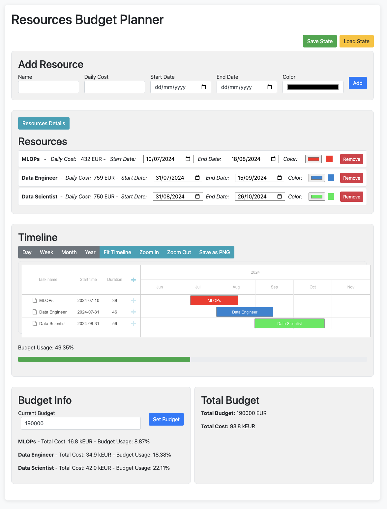

### README.md

# Resource Budget Planner

A simple web application to help visualize budget allocations for resources. It provides an easy way to manage and view budget spending in a dynamic and interactive manner.

## Features

- **No Installation Needed**: Runs directly in your browser.
- **Dynamic Visualization**: Easily visualize budget spending for each resource in real-time.
- **Interactive Gantt Chart**: Manage timelines efficiently with zoom and view adjustments.
- **User-Friendly Interface**: Clear and concise display of essential information, with separate panels for budget details.
- **Collaborative**: Feel free to reuse and improve the app. Share any suggestions for enhancements.

## Getting Started

1. Clone the repository:
   ```bash
   git clone https://github.com/piotrlaczkowski/simple-ressources-budget-planner
   ```
2. Navigate to the project directory:
   ```bash
   cd resource-budget-planner
   ```
3. Open the `index.html` file in your browser.

## Usage

- **Add Resource**: Use the form to add new resources with their details like name, daily cost, start date, end date, and color.
- **Manage Resources**: View, edit, or remove resources from the list. Changes are reflected in real-time.
- **Gantt Chart**: Visualize the timeline of resources. Adjust the view by day, week, month, or year. Zoom in and out for better clarity.
- **Budget Info**: Check detailed budget usage per resource and the total budget. The budget details are formatted for easy understanding.

## Demo

You can access the app on my [GithubPages](https://piotrlaczkowski.github.io/simple-ressources-budget-planner/) directly !!



## Contributing

Contributions are welcome! Please feel free to submit a Pull Request or open an issue.

## License

This project is licensed under the MIT License.
